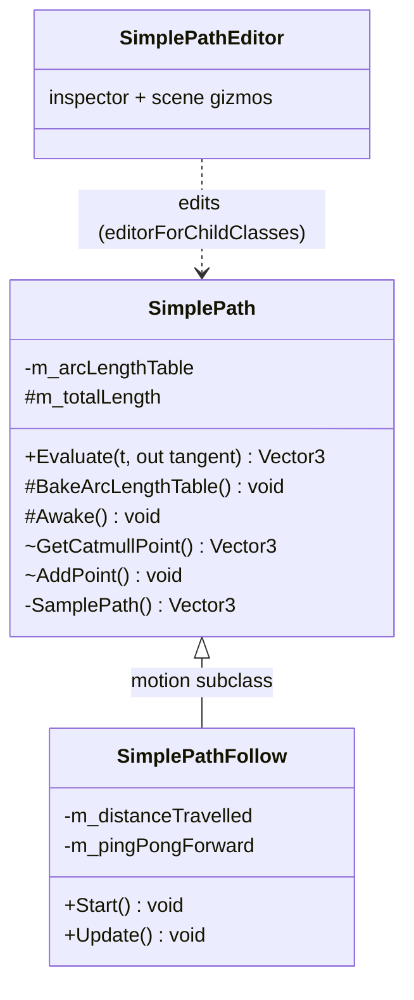
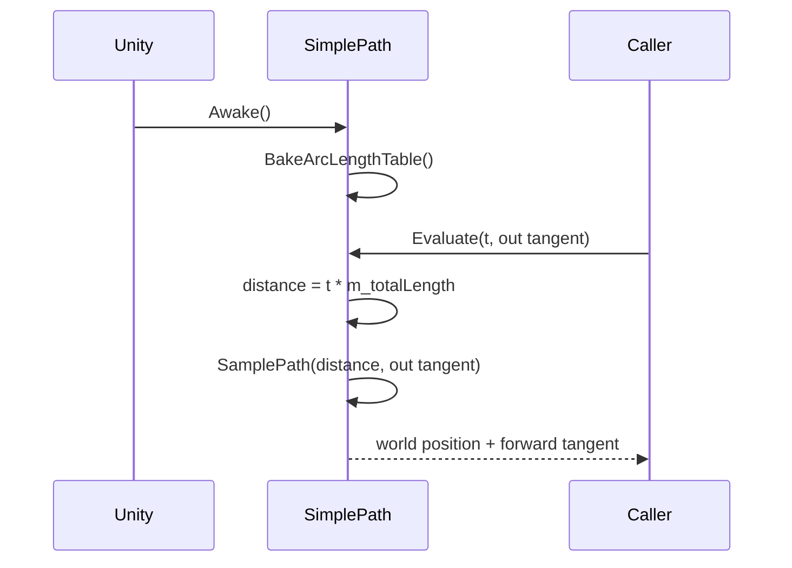
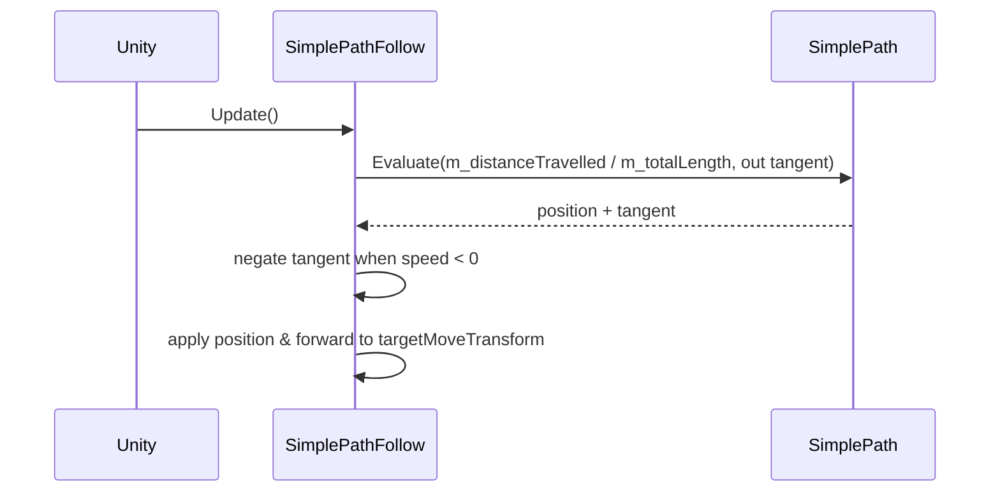

# Plan: SimplePath Base Class Extraction

| Field | Value |
|---|---|
| Status | Implemented |
| Created | 2026-05-17 |
| Updated | 2026-05-17 |
| Proficiency | N/A (retro-migrated) |
| Engine | Unity 6 (C#) |
| Revisions | 0 (latest: none) |
| Summary | Extract path structure & sampling from `SimplePathFollow` into a reusable `SimplePath` base class. |

## Revision Log

| ID | Date | Type | Change |
|---|---|---|---|
| (empty until first amendment) | | | |

---

## Overview

`SimplePathFollow` owned both the path (control points, arc-length table, sampling) and the motion (speed, ping-pong, looping, facing). This plan splits the path concern into a new `SimplePath` MonoBehaviour base class. `SimplePathFollow` inherits from it and keeps only the motion logic, so a path can be defined and sampled without committing to a moving follower.

## Architecture

## Key Flows

### Bake & Evaluate

### Follow tick (SimplePathFollow)

## Components

### SimplePath
Responsibility: own the path (control points, arc-length table) & expose uniform-distance sampling.
Owns: `pathPoints`, `m_arcLengthTable`, `m_totalLength`.
Pattern: Template Method base, subclasses supply motion.

Methods:
- `Evaluate(float t, out Vector3 tangent) -> Vector3`, maps `t` to `distance = t * m_totalLength`, returns world position & forward tangent
- `BakeArcLengthTable() -> void`, precomputes cumulative distances (protected, subclass may rebake)
- `GetCatmullPoint(...) -> Vector3`, Catmull-Rom sample (internal, editor access)
- `AddPoint(...) -> void`, append a control point (internal, editor access)
- `Awake() -> void`, protected virtual, bakes on startup

### SimplePathFollow : SimplePath
Responsibility: drive a transform along the path (speed, ping-pong, looping, facing).

Methods:
- `Start() -> void`, seeds `m_distanceTravelled = startingPosition * m_totalLength` & `m_pingPongForward = speed > 0f`
- `Update() -> void`, advances distance, calls `Evaluate`, applies position & forward

### SimplePathEditor
Responsibility: inspector & scene-handle editing for `SimplePath` and any subclass. Uses `[CustomEditor(typeof(SimplePath), editorForChildClasses: true)]` so one editor serves both component types. Renamed from `SimplePathFollowEditor.cs`.

## Patterns Applied

| Pattern | Where | Why |
|---|---|---|
| Template Method | `SimplePath` -> `SimplePathFollow` | base owns path & sampling; subclass owns motion |
| Inheritance + `editorForChildClasses` | `SimplePathEditor` | a single editor serves the base & every subclass |
| `InternalsVisibleTo` | `SimplePath` -> `Jam-starter.Editor` | editor reaches internal members without widening the public API |

## Open Questions
- [ ] None outstanding. All acceptance criteria below were met.

## Implementation Notes

### Member visibility (SimplePath)

| Member | Visibility | Reason |
|---|---|---|
| `pathPoints` | `internal` | editor access via `InternalsVisibleTo` |
| `catmullResolution` | `internal` | editor access |
| `looping` | `protected internal` | subclass motion logic + editor |
| `motion` | `internal` | editor access |
| `MOTION` enum | `internal` | editor access |
| `m_arcLengthTable` | `private` | internal only |
| `m_totalLength` | `protected` | subclass distance math |
| `Evaluate()` | `public` | public API |
| `BakeArcLengthTable()` | `protected` | subclass may rebake |
| `SamplePathByIndex()` | `private` | internal only |
| `SamplePath()` | `private` | internal only |
| `GetCatmullPoint()` | `internal` | editor access |
| `AddPoint()` | `internal` | editor access |
| `Awake()` | `protected virtual` | bakes on startup; subclass can override |

### Gotchas
- `[assembly: InternalsVisibleTo("Jam-starter.Editor")]` moves to `SimplePath.cs` (removed from `SimplePathFollow.cs`).
- Base-class tangent drops the speed term: `((b - a) * speed).normalized` becomes `(b - a).normalized`. `SimplePathFollow` re-applies direction by negating the tangent when `speed < 0`.
- `SimplePathFollow.Start()` no longer calls `BakeArcLengthTable()`; the bake runs in `SimplePath.Awake()`, which Unity invokes before `Start()`.
- Editor re-target touches `PathRegistry` (`List<SimplePath>`, `FindObjectsByType<SimplePath>`), the scene-handle loop variables, and every `SimplePathFollow.MOTION.*` reference (now `SimplePath.MOTION.*`); the serialized property string values are unchanged.

### Acceptance criteria (all met)
- [x] `SimplePath` compiles standalone with no motion fields
- [x] `Evaluate(float t, out Vector3 tangent)` returns correct world position & forward tangent for LINEAR & SMOOTH
- [x] `SimplePathFollow` behaviour is identical to pre-refactor for a moving object
- [x] Tangent is correctly negated in `SimplePathFollow` when `speed < 0`
- [x] Gizmos draw for both `SimplePath` & `SimplePathFollow` in the scene
- [x] Point add/insert/delete works in the editor for both component types
- [x] No compiler errors or warnings
