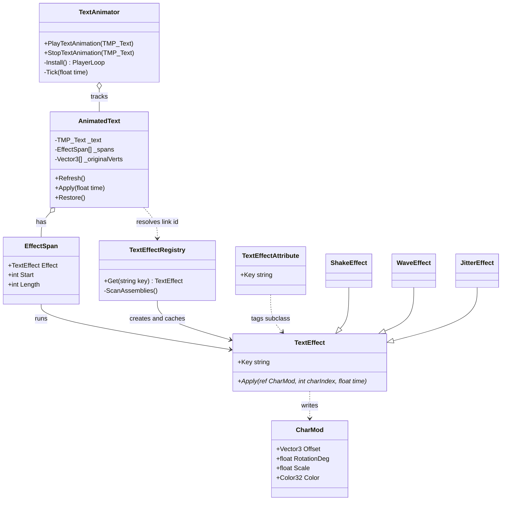
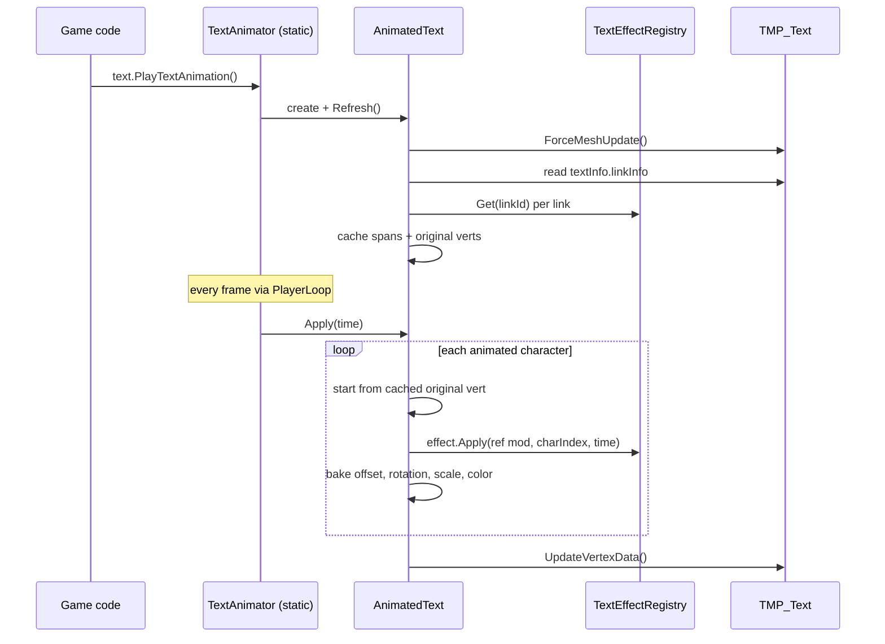
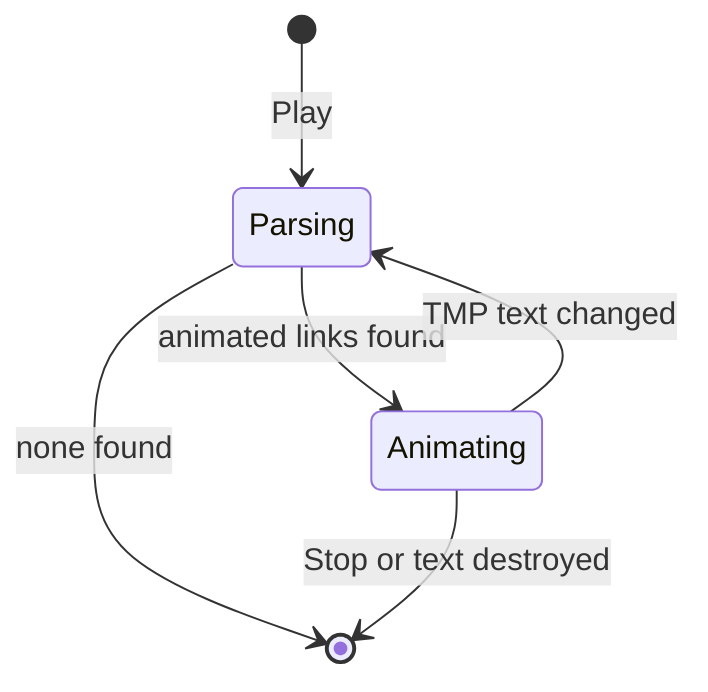

<!--
  Generated with Claude Code (model: claude-opus-4-8) on 2026-06-22.
  Author: Alex Bedard-Reid
-->

# Plan: TMP Text Animator

| Field | Value |
|---|---|
| Status | Implemented |
| Created | 2026-06-22 |
| Updated | 2026-06-23 |
| Proficiency | 3/10 |
| Engine | Unity 6 / C# |
| Revisions | 1 (latest: U-001) |
| Summary | Per-character TMP text animation (shake, wave, jitter) driven by `<link>` tags and extensible code effects. |

## Revision Log

| ID | Date | Type | Change |
|---|---|---|---|
| U-001 | 2026-06-23 | Update | Added an editor-only driver so animations preview in edit mode (scene & game view), always on. |

---

## Overview

A runtime utility that animates spans of TextMeshPro text on a per-character basis (shake, wave, jitter, and future effects). Authors wrap text in TMP-native `<link="name">` tags; the link id selects a registered effect. Animation is driven by a pure-static manager injected into Unity's PlayerLoop, so no MonoBehaviour or extra component is added to text GameObjects. New effects are added in code by subclassing an abstract effect and writing the per-character math; they are discovered automatically by reflection. Implements GitHub issue #21.

## Architecture

## Key Flows

### Opt-in and per-frame tick

### AnimatedText lifecycle

## Components

### TextAnimator (static manager)
Responsibility: own the single update loop and the set of active animated texts. Public opt-in API.
Owns: `List<AnimatedText>` of active entries.
Pattern: Update Method / Game Loop. Tick is inserted into Unity's PlayerLoop at startup via `[RuntimeInitializeOnLoadMethod]`, so there is no GameObject or MonoBehaviour.

Methods:
- `PlayTextAnimation(TMP_Text)` -> void, create or refresh an `AnimatedText` and register it.
- `StopTextAnimation(TMP_Text)` -> void, restore original vertices and unregister.
- `Install()` -> void, PlayerLoop hook; inserts the per-frame `Tick`.
- `Tick(float time)` -> void, drop destroyed texts, then call `Apply(time)` on each active entry.

### AnimatedText
Responsibility: hold the parse state and per-frame work for one TMP_Text.
Owns: the cached link spans, the snapshot of original (un-animated) vertices, and the TMP text-changed subscription.
Pattern: caches the parse so per-frame work is pure math.

Methods:
- `Refresh()` -> void, `ForceMeshUpdate`, read `textInfo.linkInfo`, resolve each link id to a registered effect, build `EffectSpan[]`, snapshot original vertices.
- `Apply(float time)` -> void, for each character in each span start from the original vert, run the effect into a `CharMod`, bake the result, then `UpdateVertexData`.
- `Restore()` -> void, write the original vertices back (used on Stop).

### EffectSpan
Responsibility: map a contiguous run of characters to a single effect.
Owns: the resolved `TextEffect`, the first character index, and the length (from `linkInfo.linkTextfirstCharacterIndex` and `linkTextLength`).

### TextEffectRegistry (static)
Responsibility: discover and cache one instance of every effect type.
Pattern: Registry plus Flyweight. Effects are stateless, so a single shared instance per type is reused across all spans and texts.

Methods:
- `Get(string key)` -> TextEffect, return the cached effect for a link id, or null if unknown.
- `ScanAssemblies()` -> void, reflection scan for non-abstract `TextEffect` subclasses carrying `[TextEffect("key")]`, instantiate once, index by key.

### TextEffect (abstract) and TextEffectAttribute
Responsibility: the extension point. A subclass declares its key via `[TextEffect("key")]`, holds its default tuning values as fields, and implements the per-character math. Marked `[Preserve]` so IL2CPP stripping keeps unreferenced effect types.
Pattern: Strategy.

Methods:
- `Apply(ref CharMod mod, int charIndex, float time)` -> void (abstract), write displacement into `mod`. `charIndex` is the index within the span.

Variants (for example `shake2`) are subclasses of an existing effect with different default field values and a different key.

### CharMod (struct)
Responsibility: the per-character output an effect writes. Identity defaults (zero offset, zero rotation, unit scale, white). Passed by ref so future effect kinds can use rotation, scale, or color without changing the abstract signature.
Fields: `Offset` (Vector3), `RotationDeg` (float), `Scale` (float), `Color` (Color32).

### TMP extension methods
Responsibility: the ergonomic opt-in surface, matching the repo's extension-method convention.
Methods:
- `TMP_Text.PlayTextAnimation()` -> void, forwards to `TextAnimator.PlayTextAnimation`.
- `TMP_Text.StopTextAnimation()` -> void, forwards to `TextAnimator.StopTextAnimation`.

## Patterns Applied

| Pattern | Where | Why |
|---|---|---|
| Strategy | `TextEffect` subclasses | interchangeable per-character math, added without touching the driver |
| Registry | `TextEffectRegistry` | resolve a link id to an effect; central discovery point |
| Flyweight | one effect instance per type | effects are stateless, so instances are shared |
| Update Method | PlayerLoop tick | single per-frame loop, no MonoBehaviour |
| Observer | TMP_TextChangedEvent subscription | re-parse only when the text actually changes |

## Open Questions

- [ ] `RotationDeg` plus uniform `Scale` is the v1 baking model. Confirm a 2D-friendly single-axis rotation is enough, or whether full 3D rotation is wanted later.
- [ ] Behaviour when a `<link>` id does not match any registered effect: leave the span static (treat as a plain link) versus log a warning. Default plan: leave static, no warning, so real hyperlinks are unaffected.

## Implementation Notes

Assembly setup:
- New assembly `Jam-starter.Runtime.TextAnimation` at `Runtime/Scripts/Utilities/TextAnimation/`.
- References `Unity.TextMeshPro` and the parent `Jam-starter.Runtime` (by GUID).
- `versionDefines`: `com.unity.ugui` expression `2.0.0` defines `TMP_PRESENT`. `defineConstraints`: `TMP_PRESENT`. This mirrors the existing `Tweening/UniTask` asmdef. Note: TMP ships inside `com.unity.ugui`, which is already a hard package dependency, so the guard is defensive rather than load-bearing.
- Namespace `Utilities.TextAnimation`, matching the existing `Utilities.*` convention.
- Do not hand-create `.meta` files; prompt to open Unity so it generates them, then edit as needed.

TMP mechanics:
- Original vertices must be snapshotted after `ForceMeshUpdate` and before any displacement, so each frame starts from a clean layout.
- Per character, vertex indices and the source mesh come from `textInfo.characterInfo[i]` (`vertexIndex`, `materialReferenceIndex`) into `textInfo.meshInfo[mat].vertices`.
- Apply rotation and scale around the character center (mean of its four corners), then add `Offset`, then write back. Tint by multiplying `meshInfo[mat].colors32`.
- Push results with `textComponent.UpdateVertexData(TMP_VertexDataUpdateFlags.All)`.

Edit-mode preview (always on):
- A second, editor-only assembly `Jam-starter.Editor.TextAnimation` (Editor platform, same `TMP_PRESENT` constraint) holds `TextAnimatorEditorDriver`, an `[InitializeOnLoad]` static class.
- The runtime PlayerLoop tick only runs in Play mode, so the driver ticks from `EditorApplication.update` instead, feeding `Time.realtimeSinceStartup` (the play tick feeds `Time.time`), and calls `InternalEditorUtility.RepaintAllViews()` each update so both scene and game view redraw.
- `TextAnimator` exposes `internal TickAll(float time)`, `StopAll()`, and `HasActiveTexts` to the editor assembly via `[InternalsVisibleTo]`.
- The driver discovers texts by scanning loaded scenes (on load, hierarchy change, and entering edit mode) plus subscribing to `TMP_TextChangedEvent`, so a `<link>` typed in the inspector animates immediately. Any TMP text containing a `link` tag is registered; texts whose ids resolve to no effect stay inert.
- Mesh writes go through `UpdateVertexData`, which touches the runtime mesh only (not serialized data), so the scene is not dirtied. `ForceMeshUpdate` in `Refresh` rebuilds clean layout before each snapshot, so a domain reload cannot bake a deformed mesh in as the new original. `StopAll` restores everything when leaving edit mode.

Lifecycle and edge cases:
- Subscribe to `TMP_TextChangedEvent` in `Refresh`; on a matching object, re-run `Refresh`. Unsubscribe on Stop.
- The PlayerLoop tick must drop entries whose `TMP_Text` was destroyed (null check) to avoid leaks across scene loads.
- Multi-material text (sprites, fallback fonts) spans more than one `meshInfo`; index by `materialReferenceIndex` rather than assuming a single mesh.
- TMP links cannot overlap, so one character belongs to at most one effect. This is an accepted limitation of the `<link>` markup choice.

Out of scope for v1 (documented future extensions):
- Inline per-tag params such as `<link="shake:amp=4">`. The link id is treated as a plain effect key; per-span tuning is done with subclass variants instead.
- Global character index (across the whole text) in addition to the in-span index.
- Full color or per-vertex distortion effects beyond the `CharMod` fields.

Verification:
- Add a sample scene or test that drives a TMP_Text containing `<link="shake">` and `<link="wave">` spans and confirms vertices move over time while plain text stays put.
- Reflect all changes in CHANGELOG.md (AGENTS.md rule 1).
