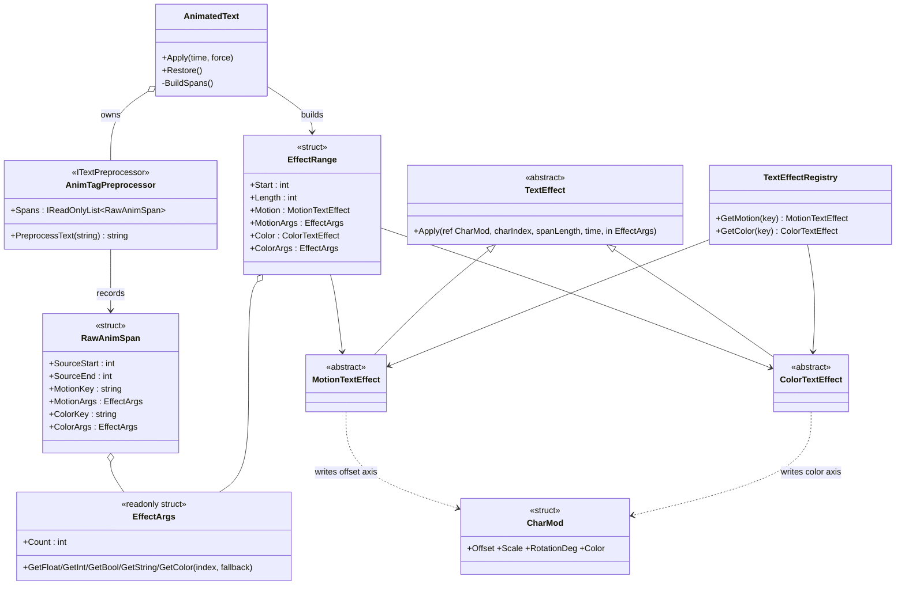
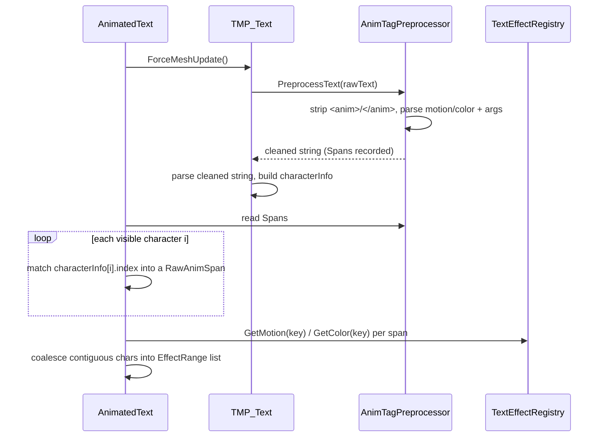
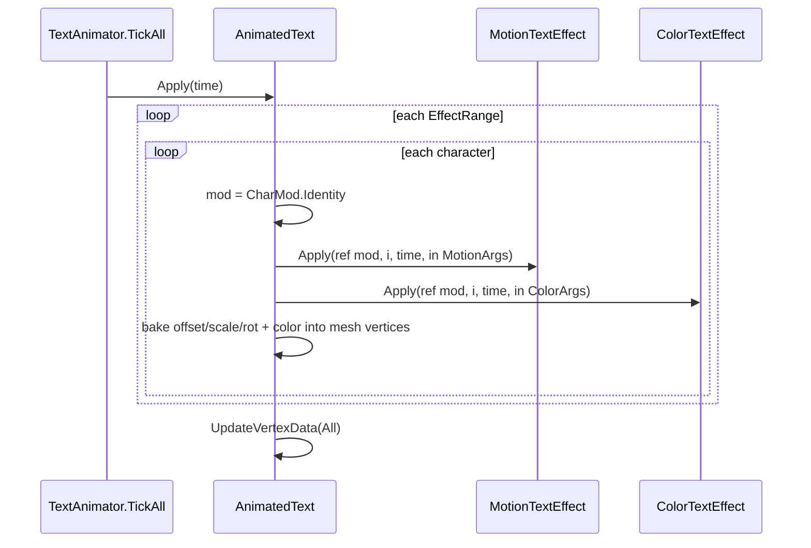

<!--
  Generated with Claude Code (model: claude-opus-4-8) on 2026-07-01.
  Author: Alex Bedard-Reid
-->

# Plan: Custom `<anim>` Tag (motion + color channels)

| Field | Value |
|---|---|
| Status | In Progress |
| Created | 2026-07-01 |
| Updated | 2026-07-04 |
| Proficiency | 3/10 |
| Engine | Unity 6 / C# |
| Revisions | 3 (latest: U-003) |
| Summary | Replace `<link>`-driven effects with a custom `<anim motion="..." color="...">` tag that layers an independent motion channel and color channel per character. |

## Revision Log

| ID | Date | Type | Change |
|---|---|---|---|
| U-003 | 2026-07-04 | Update | Review feedback: normalize the motion offset by per-character line height (`ascender - descender`) so a given amplitude reads the same in canvas & world space. Offset is now authored in ems (1.0 = one line); scale & rotation are left untouched because they are already space-independent. Re-tuned the offset-writing effects (`wave`, `shake`, `jitter`) to em fractions. |
| U-002 | 2026-07-01 | Update | Review feedback: renamed the channel bases to `MotionTextEffect` / `ColorTextEffect`, and changed `EffectArgs` from fixed float slots to raw string tokens with non-allocating typed getters, so custom effects can take any argument type & count. |
| U-001 | 2026-07-01 | Update | Resolved the Gradient open question by adding `int spanLength` to `TextEffect.Apply`, so any effect can normalize `charIndex` across its span without a per-frame allocation. |

---

## Overview

The text animator currently selects effects through TMP's native `<link="wave">` tag, which is semantically a hyperlink and can only carry one opaque id per span. This plan introduces a dedicated `<anim>` tag with two independent axes: `motion` (vertex offset / scale / rotation) and `color` (per-character tint / alpha). Both can be set on the same run and compose onto one `CharMod`. Because TMP does not parse custom tags, an `ITextPreprocessor` strips `<anim>` before TMP parses and records each span's source-string range plus its motion/color keys and inline args; `AnimatedText` maps those source ranges to visible characters via `TMP_CharacterInfo.index`. Effects split into two abstract channels so a color effect can never be resolved as a motion, and vice versa. Inline positional args (`wave(20, 2)`) keep tags small; they are parsed once at refresh into a value-type arg bag and read allocation-free each frame. The `<link>` path is removed (the feature is unreleased), returning `<link>` to genuine hyperlink use.

## Architecture

## Key Flows

### Parse and build spans (on text change / Refresh)

### Apply per frame (hot path)

## Components

### AnimTagPreprocessor (`ITextPreprocessor`)
Responsibility: turn raw markup into a TMP-parseable string and a table of animation spans.
Owns: `List<RawAnimSpan>` for the last preprocessed string (one preprocessor per `AnimatedText`).
Pattern: Strategy (TMP's preprocessor hook), single-pass tokenizer.

Methods:
- `PreprocessText(string source) -> string`: single forward pass. Copy every character into an output buffer except `<anim ...>` and `</anim>` tokens. On an opening tag, parse `motion`/`color` attribute values (each an optional `key(arg, arg, ...)`), push `{ SourceStart = output.Length, keys, args }` onto a tag stack. On a closing tag, pop and finalize `SourceEnd = output.Length`. Return the output string. Uses a stack even though v1 is flat, so nesting is a later parser-only change.
- Attribute value parse: split `key(args)` into key + positional string tokens stored in `EffectArgs`; effects interpret the tokens with typed getters and fall back to defaults for missing ones.

### RawAnimSpan (struct)
Responsibility: one parsed `<anim>` run in preprocessed-string coordinates.
Fields: `SourceStart`, `SourceEnd` (indices into the cleaned string), `MotionKey`, `MotionArgs`, `ColorKey`, `ColorArgs`.

### EffectArgs (readonly struct)
Responsibility: positional arg bag holding the raw string tokens, so an effect can interpret and validate any type (float, int, bool, string, hex color) rather than being limited to a fixed set of floats.
Owns: a `string[]` of tokens, split once per text change, + `Count`.
Methods:
- `GetFloat` / `GetInt` / `GetBool` / `GetString` / `GetColor(int index, T fallback) -> T`: non-allocating typed parse of token `index`, or `fallback` when the author omitted it. Per-frame reads allocate nothing.

### EffectRange (struct, modified)
Responsibility: a coalesced run of visible characters sharing the same resolved motion + color.
Fields (replaces the current single `Effect`): `Start`, `Length`, `Motion` (`MotionTextEffect`, nullable), `MotionArgs`, `Color` (`ColorTextEffect`, nullable), `ColorArgs`.

### TextEffect / MotionTextEffect / ColorTextEffect
Responsibility: `TextEffect` stays the abstract base; `MotionTextEffect` and `ColorTextEffect` are abstract subclasses that a concrete effect extends to declare its channel.
Pattern: Flyweight (one shared stateless instance per key), Template Method (`Apply`).

Methods:
- `Apply(ref CharMod mod, int charIndex, int spanLength, float time, in EffectArgs args)`: signature gains `spanLength` (chars in the span, for normalizing position) and `in EffectArgs`. Motion effects write `Offset`/`Scale`/`RotationDeg`; color effects write `Color`. Existing wave/shake/jitter/pulse re-parent to `MotionTextEffect` and read tuning from `args` with field defaults as fallback.

### TextEffectRegistry (modified)
Responsibility: reflection discovery split by channel.
Owns: two dicts (`motion`, `color`).
Methods:
- `GetMotion(string key) -> MotionTextEffect` / `GetColor(string key) -> ColorTextEffect`: scan tags each type with `TextEffectAttribute`, then route by `typeof(MotionTextEffect).IsAssignableFrom(type)` vs `ColorTextEffect`. Duplicate-key warning is per channel.

### AnimatedText (modified)
Changes: construct + assign `m_textComponent.textPreprocessor = m_preprocessor` before the first `Refresh`; null it in `Dispose`. `BuildSpans` no longer reads `textInfo.linkInfo`; it walks visible characters, matches `characterInfo[i].index` into `m_preprocessor.Spans`, resolves motion/color via the registry, and coalesces contiguous same-span characters into `EffectRange`s. `ApplyToCharacter` calls the motion effect then the color effect onto one `CharMod`.

### Color effects (new, v1 seed)
- `RainbowColorEffect` (`rainbow`, `rainbow(speed)`): `Color.HSVToRGB` with hue = f(charIndex, time).
- `GradientColorEffect` (`gradient`): static lerp between two default colors by `charIndex / length`. (Needs span length; pass via `charIndex` plus a normalized position or resolve length in `Apply` from args; see Open Questions.)
- `FadeColorEffect` (`fade`, `fade(speed)`): alpha = `0.5 + 0.5 * sin(time * speed)`, RGB untouched.
- `FlashColorEffect` (`flash`, `flash(period)`): toggles between two default colors on `time % period`.

## Patterns Applied

| Pattern | Where | Why |
|---|---|---|
| Strategy | `ITextPreprocessor` hook | intercept parsing to support a non-native tag |
| Flyweight | `TextEffectRegistry` shared instances | effects are stateless; params ride on the range |
| Template Method | `TextEffect.Apply` | fixed pipeline, per-effect math |
| Channel split (two base classes) | `MotionTextEffect` / `ColorTextEffect` | compile-time guarantee an effect stays in its axis |

## Open Questions

- [ ] Gradient needs the span length to normalize `charIndex`; either pass span length into `Apply` (signature) or bake a normalized position. Decide during implementation without a signature change if possible (e.g. `EffectArgs` carries length, or `ApplyToCharacter` pre-normalizes).
- [ ] `.meta` files for all new scripts must be generated by opening Unity (never hand-created).

## Implementation Notes

- **Order of build:** the preprocessor runs *inside* `ForceMeshUpdate`, so `AnimatedText` must assign `textPreprocessor` before its first `Refresh`, then read `Spans` after `ForceMeshUpdate` returns.
- **Index mapping is verified:** TMP populates its backing array from `PreprocessText(m_text)` (TMP_Text.cs:2024) and sets `characterInfo[i].index = textProcessingArray[i].stringIndex` (TextMeshProUGUI.cs:2127), so `characterInfo[i].index` is a position in the cleaned string, matching `RawAnimSpan` coordinates. Surrogate-pair glyphs point at their first UTF-16 unit, consistent with `string.Length` bookkeeping.
- **Flat v1, nesting deferred (non-breaking):** the preprocessor keeps a tag stack and `BuildSpans` resolves motion/color per character, so adding overlap/nesting later is a parser change with `Apply` untouched.
- **Zero-GC hot path:** all string work (attribute + arg parse) happens once per refresh; `EffectArgs` is a value type read by `in`, so `Apply` allocates nothing.
- **Replace `<link>`:** delete the `linkInfo` walk in `BuildSpans`; re-author the existing mesh tests (`AnimatedTextMeshTests`) and any docs/samples from `<link="key">` to `<anim motion="key">`. `<link>` returns to hyperlink duty.
- **Effects migration:** `WaveMotionEffect`, `ShakeMotionEffect`, `JitterMotionEffect`, `PulseMotionEffect` change their base from `TextEffect` to `MotionTextEffect` and adopt the `in EffectArgs` parameter (reading their existing tuning fields as arg fallbacks).
- **Tests to add:** preprocessor strip + range recording (incl. a run containing a nested non-anim tag like `<b>`), positional arg parse + fallback, per-channel registry resolution, motion+color composition on one range, and the four color effects' sign/bounds checks. EditMode for pure parse/math, PlayMode for mesh.
- **CHANGELOG:** update under Unreleased per house style; note the `<link>` -> `<anim>` change as a behavior change, not just an addition.
- **Offset normalization (em units, U-003):** `ApplyToCharacter` multiplies `mod.Offset` by `emScale = Mathf.Max(0.0001f, characterInfo.ascender - characterInfo.descender)` before adding it, so an offset of `1.0` equals one line height regardless of the canvas-vs-world scale that produced the mesh. The value is applied after rotation, so it reads as an em-space translation. Only offset is normalized: `Scale` is a multiplier about the glyph center and `RotationDeg` is in degrees, both already space-independent. Offset-writing effects re-tune their defaults to em fractions (`wave` ~0.2, `shake` ~0.12, `jitter` position ~0.1); `pulse` writes `Scale` and is unchanged. `emScale` is constant per character between text changes, so it may be cached alongside the vertex snapshot rather than recomputed each frame. Rejected alternatives: the reviewer's per-glyph rendered height (`top - bottom`), which gives short glyphs like `.` far less travel than tall ones and an uneven wave baseline; and a reference-size divisor (`lineHeight / 36`), which preserves old amplitude numbers but bakes in an arbitrary constant. EditMode effect-math tests assert the raw `CharMod.Offset` (now in ems) and are unaffected; mesh/smoke tests assert bounded/sign movement and still hold.
