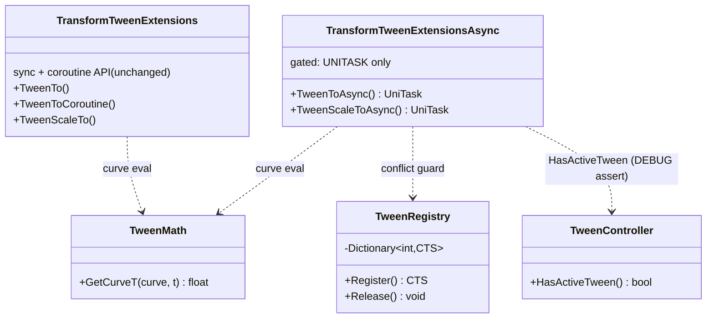
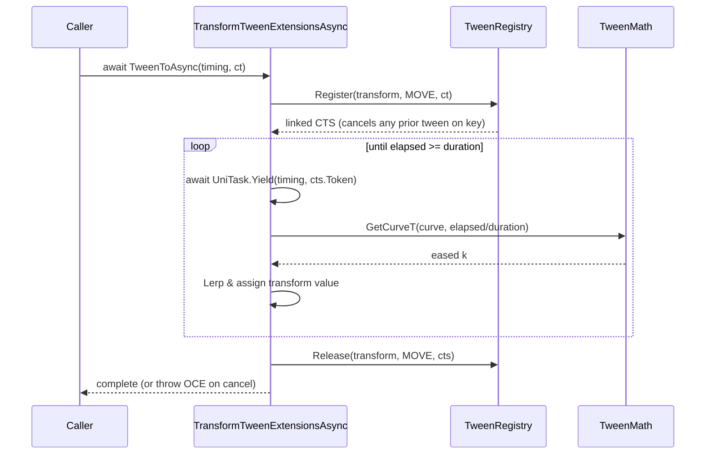
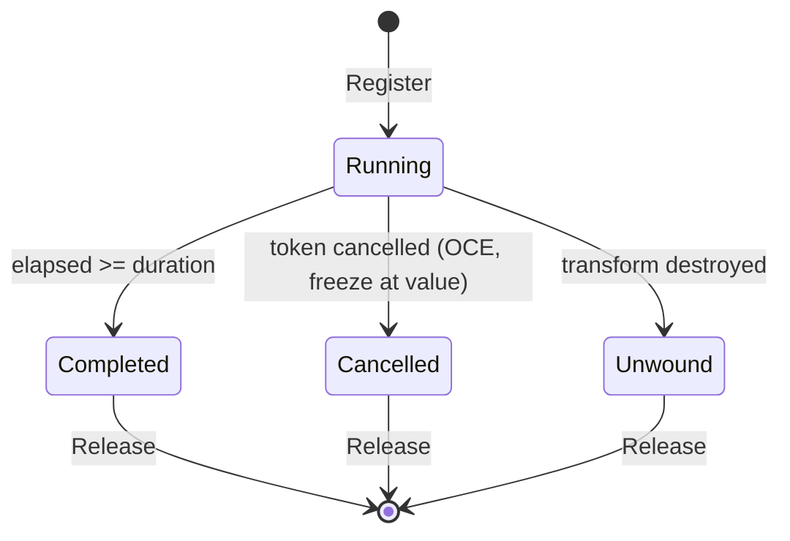

# Plan: Async Tweening Backend (Optional UniTask)

| Field | Value |
|---|---|
| Status | Implemented |
| Created | 2026-06-13 |
| Updated | 2026-06-13 |
| Proficiency | N/A (retro-migrated) |
| Engine | Unity 6 (C#) |
| Revisions | 0 (latest: none) |
| Summary | Add a UniTask-powered async tween backend alongside the existing sync engine; callers pick the backend at the call site. |

## Revision Log

| ID | Date | Type | Change |
|---|---|---|---|
| (empty until first amendment) | | | |

---

## Overview

Adds a UniTask-powered async tween backend that lives beside the existing `TweenController` engine. The sync (`TweenTo`) and coroutine (`TweenToCoroutine`) APIs stay on the existing engine, untouched. A new `TweenToAsync` family in a gated assembly returns `UniTask`, exposes `PlayerLoopTiming`, and supports native `CancellationToken` cancellation. This is the F1 architecture: two independent backends, two independent API surfaces, end-user picks explicitly at the call site. UniTask stays optional, gated behind `defineConstraints: ["UNITASK"]`.

## Architecture



`[assembly: InternalsVisibleTo("Jam-starter.Runtime.tweening.unitask")]` lives in a new `Runtime/Scripts/Utilities/Tweening/AssemblyInfo.cs` so the gated asmdef can reach `TweenController.HasActiveTween()` and `TRANSFORM`.

## Key Flows

### TweenToAsync lifecycle



### Tween state (async path)



## Components

### TweenMath
Responsibility: curve evaluation shared by both engines so easing cannot drift.
Methods:
- `GetCurveT(CURVE curve, float t) -> float`, moved out of `TweenController`

### TransformTweenExtensionsAsync (gated assembly)
Responsibility: awaitable tween overloads. Each call is its own async state machine; there is no central controller.
Methods:
- `TweenToAsync(Transform, SPACE, Vector3, float, CURVE, PlayerLoopTiming, CancellationToken) -> UniTask`
- `TweenToAsync(Transform, SPACE, Quaternion, float, CURVE, PlayerLoopTiming, CancellationToken) -> UniTask`
- `TweenScaleToAsync(Transform, Vector3, float, CURVE, PlayerLoopTiming, CancellationToken) -> UniTask`

### TweenRegistry
Responsibility: async-side conflict guard. Static `Dictionary<int, CancellationTokenSource>` keyed by `HashCode.Combine(transform, (int)transformation)`. On `Register`, an existing CTS for that key is cancelled & disposed; the returned CTS is a linked source (`CreateLinkedTokenSource(externalCt)`) so caller cancellation and newer-tween preemption flow through one token.

### TweenController (modified)
Responsibility: existing sync engine. Adds `HasActiveTween()`, removes the `AsAsncTask()` stub, and delegates curve eval to `TweenMath`.

## Patterns Applied

| Pattern | Where | Why |
|---|---|---|
| Optional dependency (define constraint) | gated `unitask` asmdef | UniTask stays optional; core compiles without it |
| Shared module (DRY) | `TweenMath` | one curve-eval source for both engines |
| Registry | `TweenRegistry` | preempt a prior async tween on the same key |
| Async state machine | `TweenToAsync` | no central controller; UniTask pools the machine |
| One-way friendship | `InternalsVisibleTo` | gated asmdef reads core internals; core stays UniTask-agnostic |

## Open Questions
- [ ] None outstanding for this scope. Deferred work is listed under Implementation Notes.

## Implementation Notes

### Reference loop

```csharp
public static async UniTask TweenToAsync(this Transform t, SPACE space, Vector3 target,
    float duration, CURVE curve = CURVE.LINEAR,
    PlayerLoopTiming timing = PlayerLoopTiming.Update,
    CancellationToken ct = default)
{
    if (t == null) return;

    #if DEBUG
    Debug.Assert(!TweenController.HasActiveTween(t, TRANSFORM.MOVE),
        $"[Tweening] TweenToAsync started on '{t.name}' while a sync tween for MOVE is active. " +
        "Mixing sync & async tweens on the same transform+transformation is undefined behaviour.");
    #endif

    var cts = TweenRegistry.Register(t, TRANSFORM.MOVE, ct);
    try
    {
        var start = space == SPACE.LOCAL ? t.localPosition : t.position;
        var elapsed = 0f;
        while (elapsed < duration)
        {
            // TODO(unscaled-time): expose ignoreTimeScale if pause-aware tweens become a need.
            await UniTask.Yield(timing, cts.Token);
            if (t == null) return;
            elapsed += Time.deltaTime;
            var k = TweenMath.GetCurveT(curve, Mathf.Clamp01(elapsed / duration));
            var p = Vector3.Lerp(start, target, k);
            if (space == SPACE.LOCAL) t.localPosition = p;
            else t.position = p;
        }
        if (t != null)
        {
            if (space == SPACE.LOCAL) t.localPosition = target;
            else t.position = target;
        }
    }
    finally
    {
        TweenRegistry.Release(t, TRANSFORM.MOVE, cts);
    }
}
```

The Rotate and Scale overloads follow the same shape.

### Decisions

| # | Decision | Rationale |
|---|---|---|
| Q1 | `AutoResetUniTaskCompletionSource`-style awaitable, not a custom `IUniTaskSource` | UniTask already pools the state machine; rebuilding the source protocol is a liability |
| Q2a | Cancellation throws `OperationCanceledException` | idiomatic UniTask; `.SuppressCancellationThrow()` is the documented opt-out |
| Q2b | Tween freezes at current value on cancel | matches DOTween `Kill()` default, lowest surprise |
| Q3 | `onCompleted` does not fire on cancel | cancellation is signalled by the OCE throw |
| Q4 | F1: two independent backends, two API surfaces | lowest coupling, explicit call-site choice |
| Q5 | UniTask stays optional via gated asmdef | honours the existing `defineConstraints: ["UNITASK"]` posture |
| Q6 | Cross-backend conflicts documented, not prevented | cheap, honest, matches DOTween-vs-external conventions |
| Q7a | Dev-time conflict check uses `#if DEBUG` | production builds pay zero cost |
| Q7b | Dev-time conflict check uses `Debug.Assert` | stops misuse early, severity matches the footgun |
| Q8a | Default `PlayerLoopTiming.Update` | matches sync engine timing |
| Q8b | `CancellationToken` defaulted | no syntactic cost for callers who skip cancellation |
| Q8c | Suffix naming `TweenToAsync`, `TweenScaleToAsync` | standard .NET / UniTask convention |
| Q9 | Always scaled `Time.deltaTime`; TODO marks the opt-in | strict parity with sync engine, cheap to extend |
| Q10 | Async-side registry uses linked CTS | one token carries caller intent & preemption |
| Q11 | Strict parity (Move / Rotate / Scale) for this PR | keeps the PR reviewable |
| Q12 | Five PlayMode tests, no GC-alloc tests yet | one test per contract decision |

### Tests (PlayMode)

Under `Tests/PlayMode/Tweening/`:
1. `TweenToAsync_AwaitCompletes_AtTargetPosition`
2. `TweenToAsync_TokenCancelled_ThrowsOCE_FreezesAtCurrentValue`
3. `TweenToAsync_TwoOnSameKey_PriorCancelledByRegistry`
4. `TweenToAsync_TransformDestroyed_ReturnsCleanly`
5. `TweenToAsync_WithActiveSyncTween_DebugAssertFires` (uses `LogAssert.Expect`)

### Non-goals & deferred work
- Replacing the sync engine, or making UniTask a hard dependency
- `TweenFromToAsync`, `PunchScale`, `Shake` overloads
- `ignoreTimeScale` on the async engine
- GC-allocation regression tests
- Sample scene demonstrating `UniTask.WhenAll` sequencing
- A `Documentation~/` page describing the dual-backend model

See `docs~/adr/0001-dual-backend-tweening.md` for the accepted decision record.
